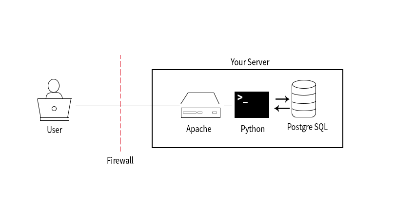

# Linux web server configuration

Project based on the Udacity ecourse **Configuration Linux Web Server** (udacity.com)

In the beginning we will use **Vegrant** to configure a ubuntu virtual machine.

    avgrant init ubuntu/trusty64
    vagrant up

**/bin** : where executable binaries ares stored, accessible from all users
**/sbin** : binaries used by only the root user for sysadmin and maintenance. This directory holds all of the applications you may need as an administrator, but normal users typically won't use.
**/lib** : for libs that support binaries that are located around the system.
**/etc** is where configuration files are stored. For example database and server configuration files
**/var** : Files that can change in size (grow) over time. System and application logs are stored in
this directory.
**/usr** : is for user's programs.

**PATH** : is where linux check for executable binaries. [Adding](https://help.ubuntu.com/community/EnvironmentVariables) a directory to the path by editing the .bashrc file adding export PATH="/path/to/dir:$PATH". But this works only for programs executed by the bash.

    source ~.bashrc

- Package source list : a list of items from where we can get software

    cat /etc/apt/source.list

- **Finger**: This application will look up various pieces of information about a user, and display it in an easy to read format.

    finger
    finger $USER

The file from where finger gets all this information is **/etc/passwd** It's used to keep track of all users on the system. The info about the specific user is organized.

    username:password:UID:GID:UID info:home directory:command/shell

Let’s run through what each of those mean:

- username: the user’s login name
- password: the password, will simply be an x if it’s encrypted
- user ID (UID): the user’s ID number in the system. 0 is root, 1-99 are for predefined users, and 100-999 are for other system u nts
- group ID (GID): Primary group ID, stored in /etc/group.
- user ID info: Metadata about the user; phone, email, name, etc.
- home directory: Where the user is sent upon login. Generally /home/
- command/shell: The absolute path of a command or shell (usually /bin/bash). Does not have to be a shell though!

## Dasabling the ssh root access

- Adding a new user

    sudo adduser 
    
- Remotely connect to a vagrant machine

    ssh hostname@localhost -p 2222

The new user doesn't have permissions to use the **sudo** command. So to fix it, we will use another user with sudo right that we can check at

    /etc/sudousers 

The last line indicates **#includedir /etc/sudoers.d** this command tells the system to also look in this directory for files and include those as if they were written directly within this file. This is done in the way to save the costom settings inserted by the administrators and avoid loosing this configuration furing system updates.

Giving access to sudo to a new user: 

    sudo cp /etc/sudoers.d/vagrand /etc/sudoers.d/student
    sudo nano /etc/sudoers.d/student

## Authentication process.
We will generate a key pair in our local/client machine and after we will move the .pub in our server (vargrant machine) in the way to enable ssh key authentication.

Generating a key-pair using ssh-kyegenInitial Server Setup 
The ssh-keygen have generated two files 

- linuxCourse
- linuxCourse.pub

The .pub file is the one that will be place the server to enable the key based authentication.

On the server machine create a new special file

    touch ~/.ssh/authorized_keys 
    
In this file are stored all the public keys this account is allowed to use for authentication. The file structure is one key per line. Now we copy here all the .pub keys. Next we change permissions on .ssh folder and files to ensure other users can't have access to this keys. 

    chmod 700 ~/.ssh # only the owner che r w x on this directory
    chmod 644 ~/.ssh/authorized_keys # only the owner can write on this file

Now we can log in our server using the key instead of the password.

    ssh student@localhost -p 2222 -i ~/.ssh/linuxCorse
 
Disabling the password log in: To do so we need to change the /etc/ssh/sshd_config on the server.Change the value of

    PasswordAuthentication yes/no

Restart the ssh service to enable the new configuration.

## Firewall UFW

        sudo ufw status

Adding rules to the Firewall:
- block all the ports so after we can enable only the ones we really need

        sudo ufw default deny incoming

- allow all the outgoing communications

        sudo ufw default allow outgoing

- open the respiting ports

        sudo ufw allow ssh
     
        sudo ufw allow 2222/tcp 
     
        sudo ufw allow www

        sudo ufw allow https

        sudo ufw enable

Server configured and ready for installing and testing software

Now I will create a snapshot of the current state of the virtual machine:

    vagrant sapshot list
    
    vagrant snapshot save 'linux-basic-configuration'

    vagrant snapshot restore

    vagrant snapshot delete

# Web Server Stack  [Configuration](https://classroom.udacity.com/courses/ud299/lessons/4340119836/concepts/48065785530923)

Tasks:
- Install and configure Apache HTTP server
- Install PostgreSQL
- Dynamic websites and data driven application with Python

For this project I am using Vagrat for configuring the virtual machine where the web web server will be installed. In this case i need to set up the port mapping in the way for the web server to be accessible from the outside. In this wa
For this reason I will change the configuration of the vagrant file mapping port 80 of the server with port 8080 on my pc. This will give access to the server using the url http://localhost:8080

    nano /vagrant/Vagrantfile

and uncomment the line

    config.vm.network "forwarded_port", guest: 80, host: 8080

After saving the file, restart the virtual machine

    vagrant reload

## Installing Apache2 

    sudo apt-get install apache2

    # check if it working
    lynx localhost:80
    
    # from the host pc
    lynx localhost:8080

    # from another pc in the network
    lynx <host-IP>:8080

Apache, by default servers its files from the /var/www/html directory. When the server has a GET request, it will serve the index.html file in this folder.
When Apache receives a request it has a number of ways it can respond. What you’ve seen thus far is the simplest method of operation, Apache just returns a file requested or the index.html file if no file is defined within the URL
But, Apache can do so much more! You’ll now configure Apache to hand-off certain requests to an application handler - mod_wsgi. 

    sudo apt-get install libapache2-mod-wsgi

You then need to configure Apache to handle requests using the WSGI module. You’ll do this by editing the 

    /etc/apache2/sites-enabled/000-default.conf 
    
This file tells Apache how to respond to requests, where to find the files for a particular site and much more.  For now, add the following line at the end of the block, right before the closing line

    <VirtualHost *:80>  
        .
        .
        .
        .
        WSGIScriptAlias / /var/www/html/myapp.wsgi
    </VirtualHost>

    sudo apache2ctl restart

[WSGI](https://wsgi.readthedocs.io/en/latest/)  is the Web Server Gateway Interface. It is a specification that describes how a web server communicates with web applications, and how web applications can be chained together to process one request. Most if not all Python web frameworks are WSGI compliant, including Flask and Django; but to quickly test if you have your Apache configuration correct you’ll write a very basic WSGI application.

Now we create the WSGI file as defined in the Apache configuration above, which despite having a .wsgi extension, is still a pythyn file.

    sudo nano /var/www/html/myapp.wsgi

    # insert the function in the file
    def application(environ, start_response):
        status = '200 OK'
        output = 'Hello Udacity!'

        response_headers = [('Content-type', 'text/plain'), ('Content-Length', str(len(output)))]
        start_response(status, response_headers)

        return [output]

    curl localhost:8080

Installing PostgreSQL

    sudo apt-get install postgresql

