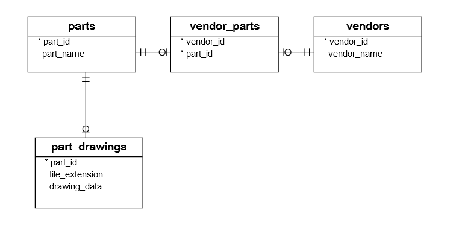

# Installing PostgreSQL 
Installing 

    sudo apt-get update
    sudo apt-get install postgresql postgresql-contrib

    Error: You need to install postgresql-server-dev-X.Y for building a server-side extension or libpq-dev for building a client-side application.

[Solved](https://www.techiediaries.com/error-you-need-to-install-postgresql-server-dev-x-y-for-building-a-server-side-extension-or-libpq-dev-for-building-a-client-side-application/)

Try it on ubuntu 18.04
Change the password of the default user so it can log in from the  

    sudo -u postgres psql

    SELECT version();
    sudo -u postgres psql -c "SELECT version();"

    CREATE DATABASE suppliers;

    # from the psql shell
    ALTER USER postgres PASSWORD 'newPassword';

    # alternative command 
    sudo -u postgres psql -c "ALTER USER postgres PASSWORD 'postgres';"

[Connect To PostgreSQL Database Server](https://www.postgresqltutorial.com/postgresql-python/connect/)

Check the files and the python repositories.

- database.ini
- config.py
- connect.py

[PostgreSQL Python Create Tables](https://www.postgresqltutorial.com/postgresql-python/create-tables/)

Database schema

